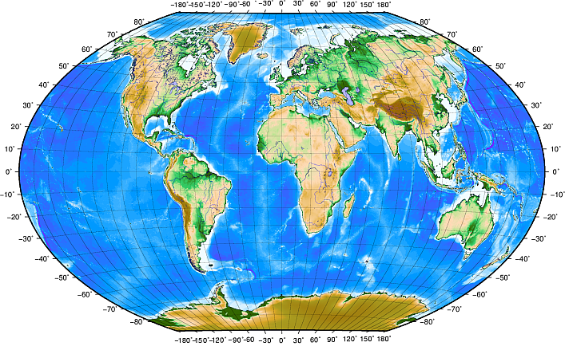

```{r setup, include=FALSE}
knitr::opts_chunk$set(echo = TRUE)
```

## **Sistemas de referencia de coordenadas**

Un sistema de referencia de coordenadas (Coordinate Reference System, CRS) es un marco utilizado para medir la posición de cualquier objeto (real o imaginario) sobre  la superficie de la Tierra mediante el uso de las  coordenadas. En términos sencillos, las proyecciones cartográficas intenta transformar la tierra de su forma esférica (3D) a una forma plana (2D).

### **Familia de proyecciones cartográficas**

Algunas formas de proyectar la superficie del planeta Tierra son: (a) superficies cilindricas; (b) superficies cónicas; o (c) superficies planas. A este conjunto de proyeccciones se le denomina proyecciones cartográficas. <br>

<center>

</center>

### **Tipos de SRC**

Existen dos tipos diferentes de sistemas de referencia de coordenadas:

Sistemas de coordenadas geográficas: Estos sistemas utilizan la latitud y la longitud para definir las ubicaciones en la tierra. Un ejemplo común es el sistema de coordenadas geográficas WGS84 utilizado por el Sistema de Posicionamiento Global (GPS).

<center>

</center>

Sistemas de coordenadas proyectadas: Estos sistemas proyectan la tierra, que es tridimensional, en un plano bidimensional. Esto permite medir distancias y áreas. Un ejemplo común es el sistema de coordenadas Universal Transverse Mercator (UTM).

<center>

</center>

### **Diferencia entre Datum y SRC**