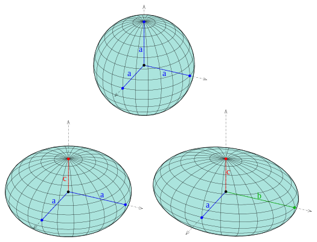

```{r setup, include=FALSE}
knitr::opts_chunk$set(echo = TRUE)
```

## Mapas en R

Para poder visualizar nuestros mapas con un conjunto de datos vectoriales vamos a emplear la librería "ggplot2". También emplearemos la librería "rnaturalearth" la cual nos proporciona mapas de todo el mundo.

```{r}
library(ggplot2)
library(rnaturalearth)
library(rnaturalearthdata)
library(sp)
library(raster)
theme_set(theme_bw()) ##?theme_bw

elMundo <- ne_countries(scale = "medium", returnclass = "sf") #Retorna poligonos de cada país del mundo, la escala media es de 1:50, la escala larga de 1:10 y la escala pequeña de 1:110. La clase de retorno puede ser sp o sf para datos espaciales

str(elMundo)

#Ahora grafiquemos nuestro mapa 

ggplot(data = elMundo) + geom_sf()

#Decoremos nuestro mapa

ggplot(data = elMundo) + geom_sf() + xlab("Longitud") + ylab("Latitud") +
  ggtitle("Paises del Mundo", subtitle = paste0("(", length(unique(elMundo$name)), " Paises)"))

#Asignemosle colores

ggplot(data = elMundo) + geom_sf(color="blue", fill = "lightgreen") + xlab("Longitud") + ylab("Latitud") +
  ggtitle("Paises del Mundo", subtitle = paste0("(", length(unique(elMundo$name)), " Paises)"))

ggplot(data = elMundo) + geom_sf(aes(fill = pop_est)) + # pop_est es una de las variables contenidas en el dataset "elMundo"
  scale_fill_viridis_c(option = "plasma", trans = "sqrt")+ #plasma es la variante de colores y sqrt la raíz de la población
  xlab("Longitud") + ylab("Latitud") +
  ggtitle("Paises del Mundo", subtitle = paste0("(", length(unique(elMundo$name)), " Paises)"))
```

## Proyección y extensión

Los sistemas de coordenadas geográficas se basan en una superficie esferoidal (ya sea verdaderamente esférica o elipsoidal) que se aproxima a la superficie de la Tierra. Un **datum** suele definir la superficie (radio ex para una esfera, eje mayor y eje menor o aplanamiento inverso para un elipsoide) y la posición de la superficie en relación con el centro de la Tierra. Por ejemplo:
<br>

<center>

</center>

<br>

<center>
<table class="default">
  <tr>
    <th scope="row">Esferoide</th>
    <th>Datum</th>
    <th>Semieje mayor</th>
    <th>Semieje menor</th>
    <th>Achatamiento</th>
  </tr>
  <tr>
    <td>Clarke 1866</td>
    <td>NAD 1927</td>
    <td>6378206.4 m</td>
    <td>6356583.8 m</td>
    <td>294.978698214</td>
  </tr>
  <tr>
    <td>GRS80 1980</td>
    <td>NAD 1983</td>
    <td>6378137.0 m</td>
    <td>6356752.3 m</td>
    <td>294.978698214</td>
  </tr>
<tr>
    <td>WGS84 1984</td>
    <td>WGS 1984</td>
    <td> 6378137.0 m</td>
    <td> 6356752.3142 m</td>
    <td>298.2572235634</td>
  </tr>
</table>
</center>


<a href="https://help.arcgis.com/es/arcgisdesktop/10.0/help/index.html#//003r00000003000000">El geoide, el elipsoide, el esferoide y el datum, y cómo se relacionan</a>

<br>

Todo sistema de referencia de coordenadas geográficas hace referencia (valga la redundancia) a un **datum**. Por otra parte tenga en cuenta que este src no se proyecta y se representa en latitud y longitud.

Por otra parte, los sistemas de referencia de coordenadas proyectados, son transformaciones que convierten un conjunto de puntos de una superficie curva (es decir está en coordenadas geográficas) en una superficie plana (generalmente medida en metros).

El datum es una parte integral de la proyección, ya que los sistemas coordinados proyectados se basan en coordenadas geográficas, que a su vez están referenciadas a un datum. Es posible, e incluso común, que los datasets estén en la misma proyección, pero que se haga referencia a diferentes datums y, por lo tanto, tengan diferentes valores de coordenadas. Por ejemplo, se puede hacer referencia a los sistemas de coordenadas del plano de estado a los datums NAD83 y NAD27. Las transformaciones de coordenadas geográficas a coordenadas proyectadas son las mismas, pero como las coordenadas geográficas son diferentes en función del datum, las coordenadas proyectadas resultantes también serán diferentes.

Miremos algunos ejemplos en R:
<br>

```{r}
ggplot(data = elMundo) +
    geom_sf() +
    coord_sf(crs = "+proj=laea +lat_0=52 +lon_0=10 +x_0=4321000 +y_0=3210000 +ellps=GRS80 +units=m +no_defs")

#+proj=laea: es el tipo de proyección que se está utilizando, en este caso, Lambert Azimuthal Equal Area (LAEA).
#+lat_0=52: es el paralelo de origen en grados, que es la latitud en la que el plano del mapa toca la esfera terrestre.
#+lon_0=10: es el meridiano central en grados, que es la longitud en la que el plano del mapa toca la esfera terrestre.
#+x_0=4321000 y +y_0=3210000:son los falsos este y norte respectivamente. Son las coordenadas en el sistema de proyección que corresponden a la latitud y longitud de origen.
#+ellps=GRS80:es el elipsoide de referencia que se está utilizando.
#+units=m: es la unidad de medida utilizada en el sistema de proyección6.
#+no_defs: este argumento se utiliza para suprimir la carga de las definiciones de elipsoide y datum por defecto


# Cambiemos la longitud y latitud en la que el plano del mapa toca la esfera en 76,3

ggplot(data = elMundo) +
    geom_sf() +
    coord_sf(crs = "+proj=laea +lat_0=3 +lon_0=76 +ellps=GRS80 +units=m +no_defs") 


```
<br>
Recordemos que la **proyección**  es el método empleado para traducir una posición en el globo o geoide en una posición en un mapa bidimensional (es decir con x,y coordenadas). Las proyecciones pueden preservar ciertas propiedades como el área, la dirección (ángulos) o las longitudes. En el caso del **elipsoide**, este es un modelo matemático o de referencia empleado para aproximar la forma de la superficie terrestre. 

**Nota:** el falso este y el falso norte son valores lineales que se aplican al origen de las coordenadas x e y, respectivamente. Se utilizan en los sistemas de coordenadas proyectadas para asegurar que todas las coordenadas x e y sean positivas (<a href="https://help.arcgis.com/en/geodatabase/10.0/sdk/arcsde/concepts/geometry/coordref/coordsys/projected/mapprojections.htm">Ver</a>).

A continuación vamos a ver visualizacions de nuestro mapa mundi empleando identificadores EPSG para algunos SRC (<a href="https://spatialreference.org/ref/epsg/?page=1">Ver más</a>).


```{r}

#epsg 3035
#+proj=laea +lat_0=52 +lon_0=10 +x_0=4321000 +y_0=3210000 +ellps=GRS80 +units=m +no_defs
#https://spatialreference.org/ref/epsg/3035/

ggplot(data = elMundo) +
    geom_sf() +
    coord_sf(crs = "+init=epsg:3035")

#epsg 4326
#+proj=longlat +ellps=WGS84 +datum=WGS84 +no_defs 
#https://spatialreference.org/ref/epsg/4326/
ggplot(data = elMundo) +
    geom_sf() +
    coord_sf(crs = "+init=epsg:4326")
```